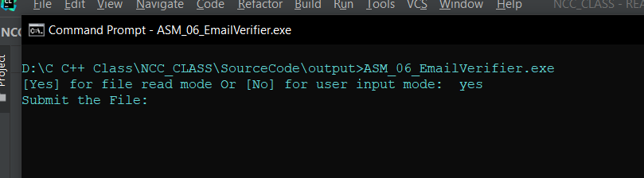
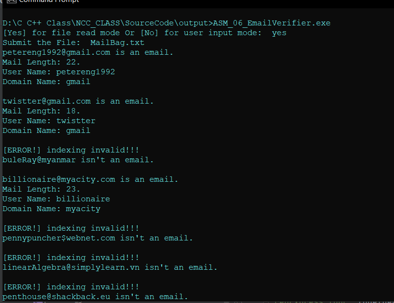
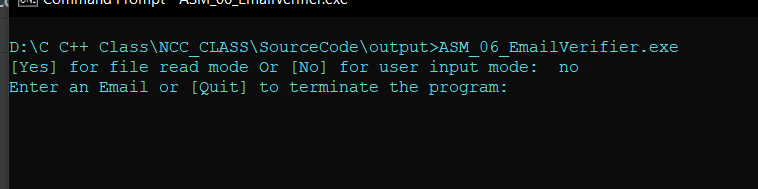
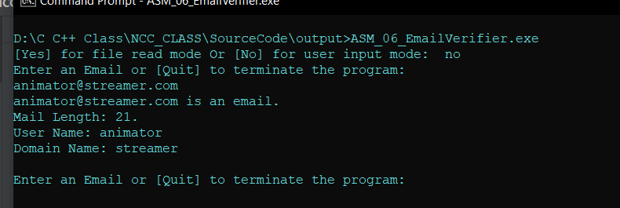
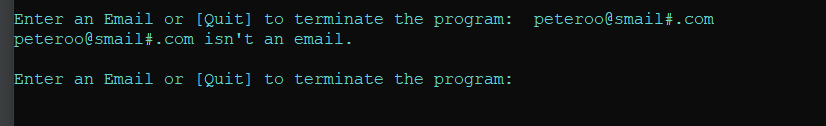

# NCC_ASM06_MailVerifier

# NCC_ASM06_MailVerifier

# NCC_Assignment06
## Mail Verifier
**About**: *The program* executes the string passed to it either from **_the File or user input_**, and verifies whether it is `mail format` or not.

All the **Function** used in the program are built in the separated library, `myLibrary.h`. 

***Notes***: No built-in libraries' functions are used such as `string.h` to manipulate the strings.

### myLibrary.h
```c
void wordUpper(char *word);
```
This function checks every single character of the string `word` whether they are in the range of `decimal 97 and 122`.
If `True`, it turns the characters to **upper** by subtracting `32`.
The function is based on ***ASCII TABLE***.
```c
int stringLen(const char *str);
```
Even though we can simply loop through `a string` until the ending characters `'\0'` is met,
it is worth to write a function to find the ***String Length*** if necessary.
So, I simply created `stringlen`, which counts until the ending `char` is met.
```c
int stringCmp(char *str1, char *str2);
```
The function compares **two strings** whether they are matched or not.
Normally, I will loop through the strings twice. But, in fact, I reuse `stringLen` function to find length of the strings.
`Two points`: `One`: the function checks whether the strings have same **length**.
If `True`, it go to `step two`, otherwise, it return `-1`.
`Two`: looping through both strings, it checks every single characters in sequence.
If `True`, it return `characters' count`.
```c
void stringCopy(char *origin, char *buff);
```
In case if you want to track on the original string, it is good to write that function.
The function find the length of the **origin** string. and loop through using `for loop`.And,
every buff's characters are assigned by origin's.
```c
int indexOf(char *str, char *idxStr);
```
It is one I like the most of `myLibrary's functions`. 
I love to write this function. In the string, a character is indexing until it is found.
If `found`, the function will return the index number of that character.
Besides, this function can be used to index a substring, like `.com` in `example@gmail.com`.
(Notes: The index is returned on first occurrence. If char is `not found`,
`-1` is returned.)
```c
char *subString(char *str, int idxA, int idxB);
```
It will be the time that we want to trim the string of a main string after indexing using `indexOf` function.
The function trim the `string` from including `idxA` to `idxB` excluding.
And, it returns the **trimmed string** as `char *`.
```c
int regExpress(char *str, char *pattern);
```
It is also one of the functions I like to write the most. Here, a given string
is loop through the array of `regex_pattern`, and state whether they are existed
in **r_pattern** or not. Return: `0` if one or more of the char is not belonged to the pattern, `1`
if all belonged to the pattern.
Here in this program, the regex pattern analysing is based again on `ASCII TABLE's decimal sequences`.
The example pattern: `A-Za-z` the program search for `-` character and decrement 1 to index to get `A` and increment 1
to get `Z`. Since, `AtoZ` is in **ascending order**, the start and end decimal of characters
are used as a `range`, and loop through the array to get sequences of patterns.
In the next jump, find another `-`, execute the same and `append to the array`.
You can apply `any printable character sequences of pattern` to the `parameter` in ascending order(not `Z-A`).
> **_THIS IS THE END OF MYLIBRARY_**

### Main Program
> Well, main program just simply use the power of myLibrary.h.
> We got not too much to talk about.

* Since, I want to program both for FILE_READ_MODE and USER_INPUT from stdin, I created ``operationMode func``
* Then, I pass every single string to the function called ``mailVerify`` using `r_pattern` parameter.

In ***operationMode func***:
If you say...yes, it will direct to file mode, you will submit a file containg a pie of
emails, mails and non email formats.
The `func` will parse every string in the file and feed one by one to `mailVerify function`.
If you say...no, it will direct `STDIN MODE`.

In ***MailVerify func***:
It finds the key word of `@` and `.com` using our `indexOf func`.
And, it trims the string b/t the two indexes, and passes it to the  
`regExpress func` together with desired `r_pattern`, and do the rest.

>**HERE ARE THE OUTPUTS**











> HAVE A FUN 

> ************************ **_THE END_** *********************************

>>>>>>> 297994f (Updated README)
>>>>>>> a273d2f (second commit)
